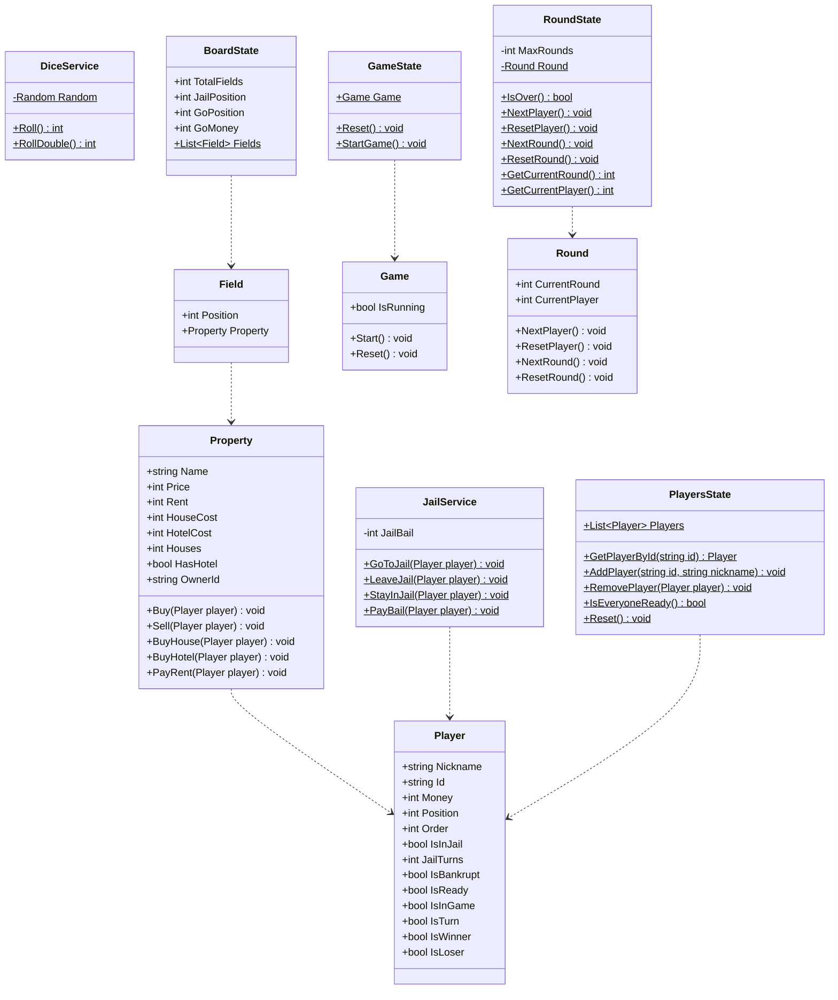

# Diagram klas

```mermaid
classDiagram
    class Player {
        +string Nickname
        +string Id
        +int Money
        +int Position
        +int Order
        +bool IsInJail
        +int JailTurns
        +bool IsBankrupt
        +bool IsReady
        +bool IsInGame
        +bool IsTurn
        +bool IsWinner
        +bool IsLoser
    }
    
    class Property {
        +string Name
        +int Price
        +int Rent
        +int HouseCost
        +int HotelCost
        +int Houses
        +bool HasHotel
        +string OwnerId
        +Buy(Player player) void
        +Sell(Player player) void
        +BuyHouse(Player player) void
        +BuyHotel(Player player) void
        +PayRent(Player player) void
    }
    
    class Field {
        +int Position
        +Property Property
    }
    
    class Game {
        +bool IsRunning
        +Start() void
        +Reset() void
    }
    
    class Round {
        +int CurrentRound
        +int CurrentPlayer
        +NextPlayer() void
        +ResetPlayer() void
        +NextRound() void
        +ResetRound() void
    }
    
    class DiceService {
        -Random Random$
        +Roll() int$
        +RollDouble() int$
    }
    
    class JailService {
        -int JailBail
        +GoToJail(Player player) void$
        +LeaveJail(Player player) void$
        +StayInJail(Player player) void$
        +PayBail(Player player) void$
    }

    class BoardState {
        +int TotalFields
        +int JailPosition
        +int GoPosition
        +int GoMoney
        +List~Field~ Fields$
    }
    
    class GameState {
        +Game Game$
        +Reset() void$
        +StartGame() void$
    }
    
    class PlayersState {
        +List~Player~ Players$
        +GetPlayerById(string id) Player$
        +AddPlayer(string id, string nickname) void$
        +RemovePlayer(Player player) void$
        +IsEveryoneReady() bool$
        +Reset() void$
    }
    
    class RoundState {
        -int MaxRounds
        -Round Round$
        +IsOver() bool$
        +NextPlayer() void$
        +ResetPlayer() void$
        +NextRound() void$
        +ResetRound() void$
        +GetCurrentRound() int$
        +GetCurrentPlayer() int$
    }
    
    Property ..> Player
    Field ..> Property
    JailService ..> Player
    BoardState ..> Field
    GameState ..> Game
    PlayersState ..> Player
    RoundState ..> Round
```