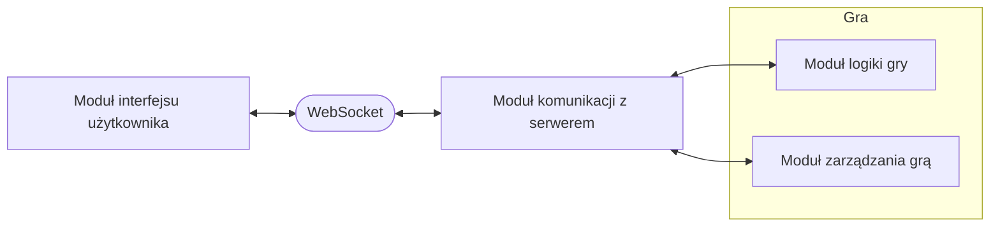

# Diagram modułów

```mermaid
flowchart LR
    Web[Moduł interfejsu użytkownika]
    CommunicationHub[Moduł komunikacji z serwerem]
    GameLogic[Moduł logiki gry]
    GameManagement[Moduł zarządzania grą]
    WebSocket([WebSocket])
    
    Web <--> WebSocket <--> CommunicationHub 
    
    CommunicationHub <--> GameLogic
    CommunicationHub <--> GameManagement
    
    subgraph Gra 
        GameLogic
        GameManagement
    end
    
```