# Diagramy sekwencji
## Rzut kostką
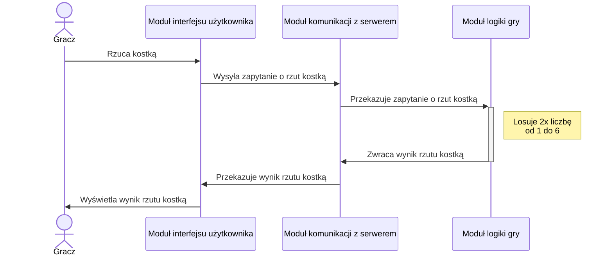

## Wykonanie ruchu
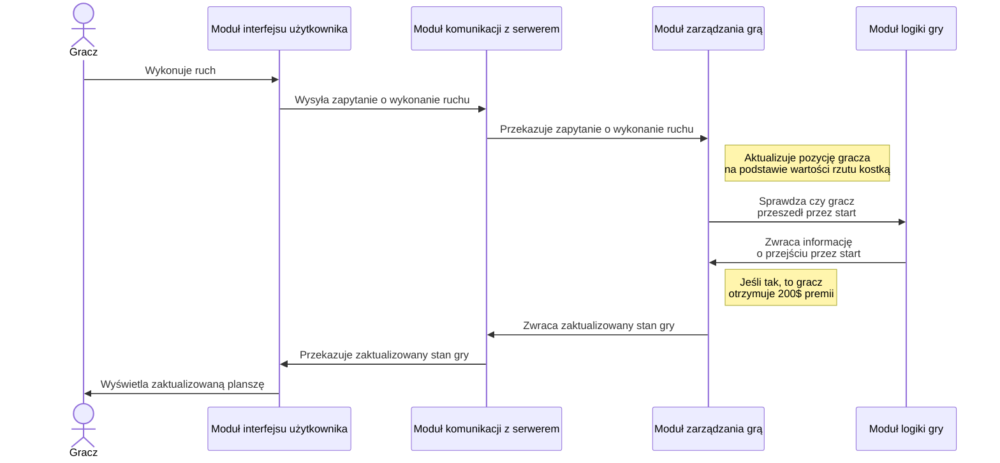

## Kupno nieruchomości
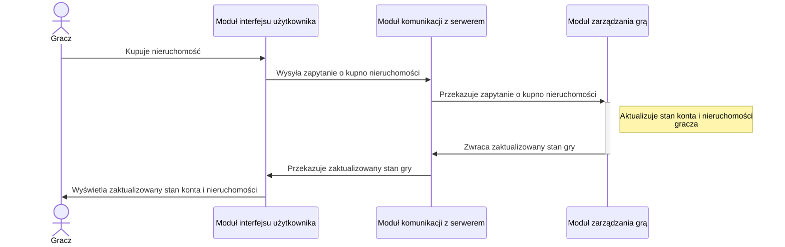

## Kupno budynku
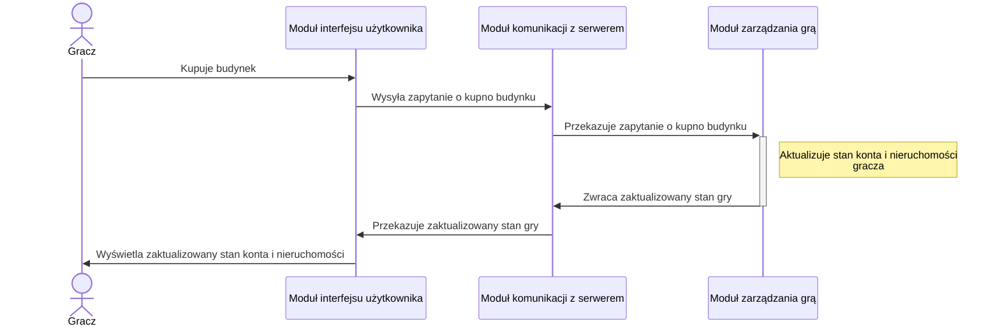

## Płatność czynszu
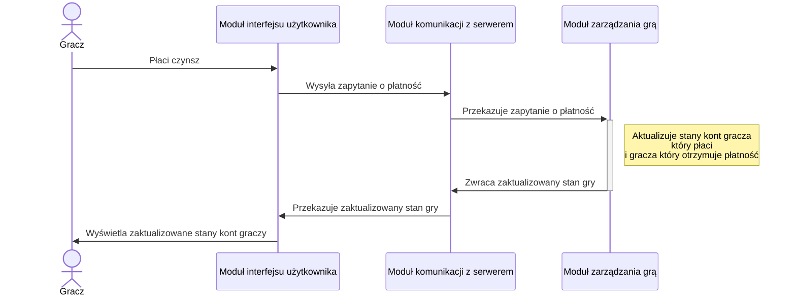

## Otrzymanie karty
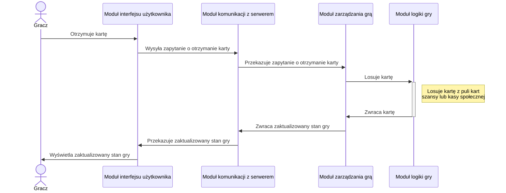

## Przejście na pole Idziesz do więzienia
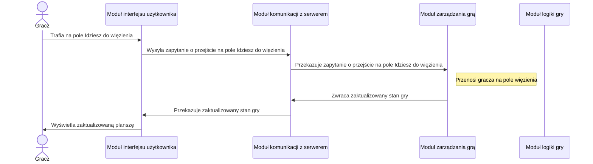

## Wyjście z więzienia (płacąc grzywnę)
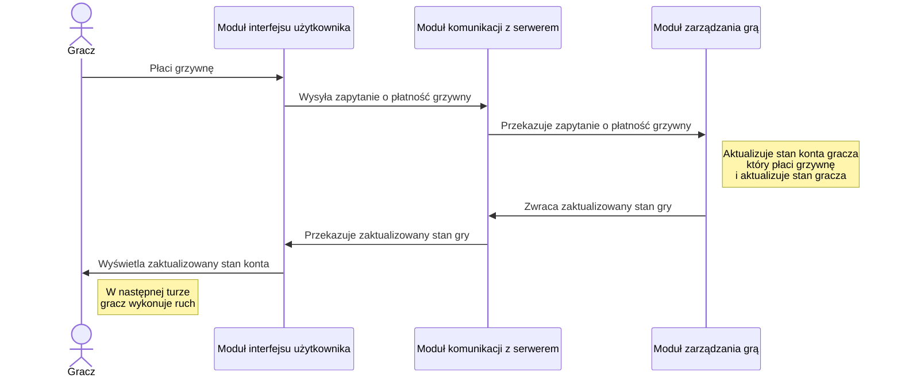

## Wyjście z więzienia (używając karty wyjścia z więzienia)
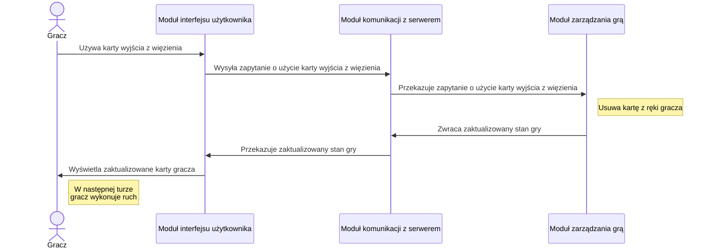

## Wyjście z więzienia (bez płacenia grzywny lub karty wyjścia z więzienia)
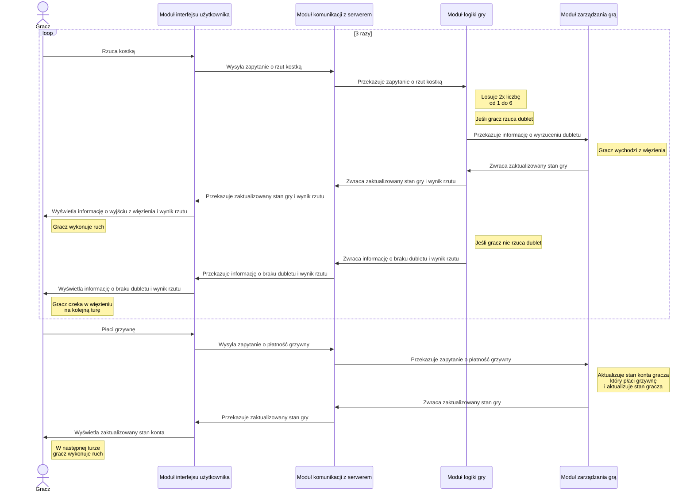

## Zatrzymanie się na darmowym parkingu
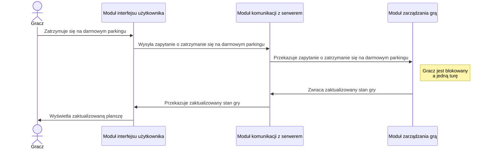

## Bankructwo
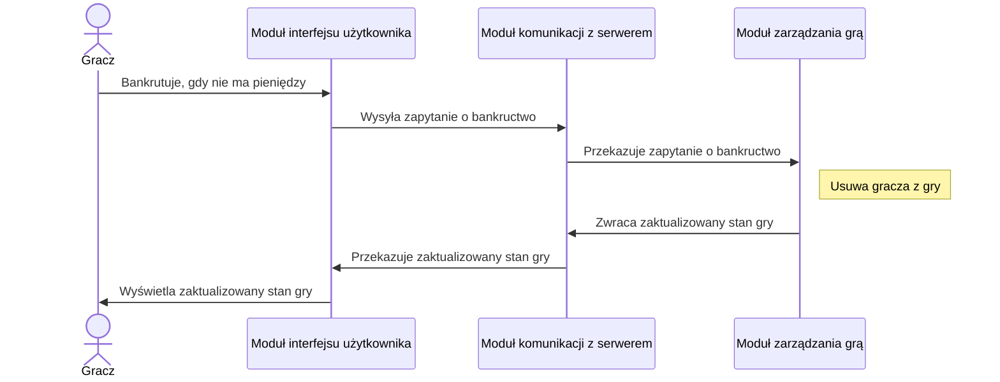

## Sprzedaż nieruchomości
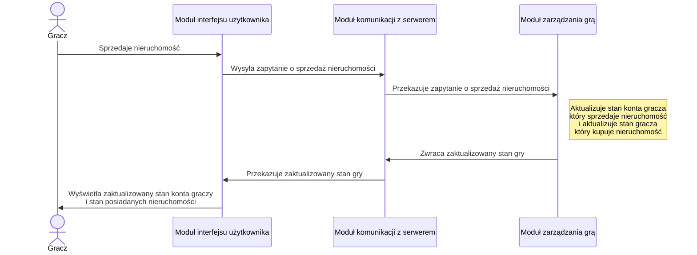