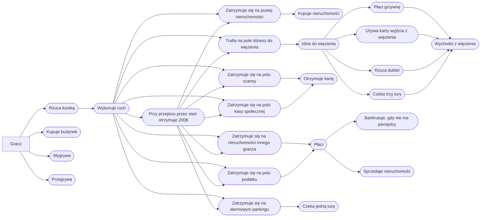

# Diagram przypadków użycia

```mermaid
flowchart LR
  player["Gracz"]
  rollsTheDice(["Rzuca kostką"])
  makesTheMove(["Wykonuje ruch"])
  buysTheProperty(["Kupuje nieruchomość"])
  buysBuilding(["Kupuje budynek"])
  pays(["Płaci"])
  getsCard(["Otrzymuje kartę"])
  getsStartBonus(["Przy przejściu przez start otrzymuje 200$"])
  getsOnGoToJail(["Trafia na pole Idziesz do więzienia"])
  goesToJail(["Idzie do więzienia"])
  paysTheFine(["Płaci grzywnę"])
  usesGetOutOfJailCard(["Używa karty wyjścia z więzienia"])
  waitsThreeTurns(["Czeka trzy tury"])
  rollsDouble(["Rzuca dublet"])
  getsOutOfJail(["Wychodzi z więzienia"])
  bankrupts(["Bankrutuje, gdy nie ma pieniędzy"])
  getsOnFreeParking(["Zatrzymuje się na darmowym parkingu"])
  waitsOneTurn(["Czeka jedną turę"])
  sellsProperty(["Sprzedaje nieruchomość"])
  getsOnEmptyProperty(["Zatrzymuje się na pustej nieruchomości"])
  getsOnOwnedProperty(["Zatrzymuje się na nieruchomości innego gracza"])
  getsOnChance(["Zatrzymuje się na polu szansy"])
  getsOnCommunityChest(["Zatrzymuje się na polu kasy społecznej"])
  getsOnTax(["Zatrzymuje się na polu podatku"])
  wins(["Wygrywa"])
  loses(["Przegrywa"])

  player --> rollsTheDice
  player --> buysBuilding
  player --> wins
  player --> loses
    
  rollsTheDice --> makesTheMove
  
  makesTheMove --> getsStartBonus
  makesTheMove --> getsOnGoToJail --> goesToJail
  makesTheMove --> getsOnFreeParking --> waitsOneTurn
  makesTheMove --> getsOnEmptyProperty --> buysTheProperty
  makesTheMove --> getsOnOwnedProperty --> pays
  makesTheMove --> getsOnChance --> getsCard
  makesTheMove --> getsOnCommunityChest --> getsCard
  makesTheMove --> getsOnTax --> pays
  
  getsStartBonus --> getsOnGoToJail
  getsStartBonus --> getsOnFreeParking
  getsStartBonus --> getsOnEmptyProperty
  getsStartBonus --> getsOnOwnedProperty
  getsStartBonus --> getsOnChance
  getsStartBonus --> getsOnCommunityChest
  getsStartBonus --> getsOnTax
  
  goesToJail --> paysTheFine --> getsOutOfJail
  goesToJail --> usesGetOutOfJailCard --> getsOutOfJail
  goesToJail --> rollsDouble --> getsOutOfJail
  goesToJail --> waitsThreeTurns --> getsOutOfJail
  
  pays --> sellsProperty
  pays --> bankrupts
```