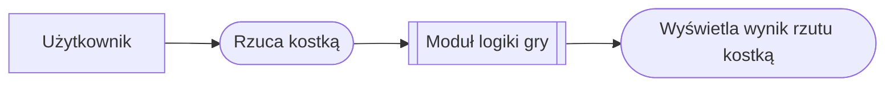

# Diagramy przypadków użycia

## Rzut kostką

```mermaid
flowchart LR
  user["Użytkownik"]
  rollsTheDice(["Rzuca kostką"])
  gameLogicModule[["Moduł logiki gry"]]
  returnsDiceValue(["Wyświetla wynik rzutu kostką"])

  user --> rollsTheDice --> gameLogicModule --> returnsDiceValue
```